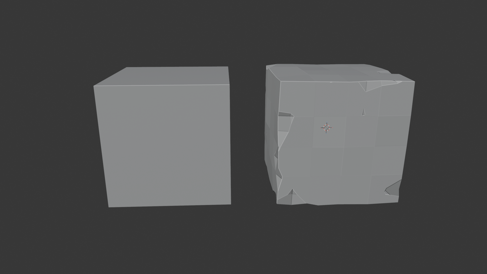

# DamageTheMesh

A Blender add-on for applying procedural surface and edge damage to meshes, with the option for adjusting intensity and visual appearance.

Download the DamageTheMesh.py file and install it in Blender via Edit → Preferences → Add-ons → Install from Disk, then select the file DamageTheMesh.py.

